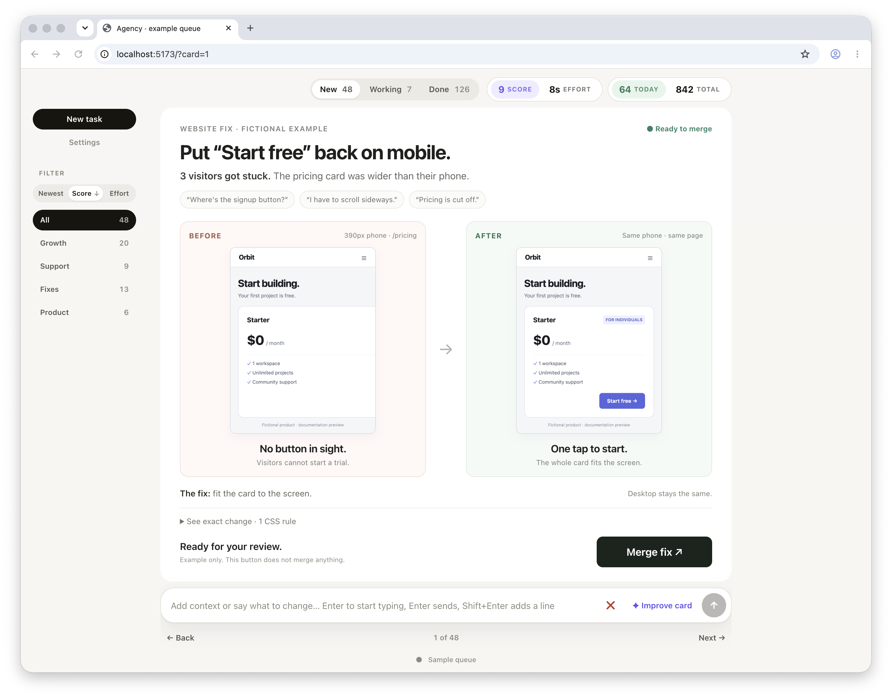

# Agency

<br>

## Human

Copy this into your coding agent:

```text
Start agency. Create a me.md file and make the first 10 suggestions.
```

[Setup instructions ↓](#run-locally)

<br><br>



*Actual localhost app. Sample cards, points and reports. Before/after screenshots show a fictional pricing page; no real PR.*

<br>

See the finished work. Click once. Your agent handles the rest.

The package starts empty. It includes no personal profile, tickets, customer media or credentials.

## Linear-backed Agency

Use Linear for shared tickets and keep this localhost UI for visual decisions. Use a separate
**Agency project** in an existing team. Assign imports and new tickets to the configured user;
hand-offs change the native assignee. Growth, Support, Fixes and Product can be team labels.

```text
Linear: issues, owners, states, estimates, committed card revisions and decisions
                         ↕ Linear CLI
localhost: the same cards, diffs, media, feedback and next-card navigation
private files: me.md, topic display preferences, local cache and pending timer samples
```

This optional adapter runs locally through `@schpet/linear-cli@2.6.0`. The CLI stores credentials
in Keychain. Do not put a token in browser code or in Git. The default D1 backend still works
when the adapter is not configured. This is not a hosted multi-user server.

### Set up or migrate

1. Run `npx --yes @schpet/linear-cli@2.6.0 auth login` for the intended workspace. Verify the
   identity with `auth whoami`. Use CLI help to resolve the project, team, user, state and label IDs.
   Do not change an existing team's estimate settings just for Agency.
2. Copy `linear.config.example.json` to ignored `.linear-migration.json`. Set absolute local paths,
   identity, project, members and state mappings. Keep `enableWrites: false` until verification.
   Fill any explicit privacy exclusions **before exporting**. Keep the source namespace stable.
3. Pause other ticket writers, then run:

   ```sh
   node scripts/linear-migrate.mjs .linear-migration.json export
   node scripts/linear-migrate.mjs .linear-migration.json import
   node scripts/linear-migrate.mjs .linear-migration.json verify
   ```

   Export reads the original database without changing it. Import uses deterministic issue IDs,
   so an uncertain request can be reconciled without duplicate tickets. Never rerun export over
   an active migration: reconcile source changes first. Review the export for private material
   and credentials before importing. Automated redaction is not a complete privacy review.
4. Package the exported records/HTML and `public` assets into private archives. Attach them using
   `linear issue attach ISSUE archive.tgz --title "Agency archive"` without `--public`. Record
   checksums and link the archive issue from the project's overview. Keep all ticket data out of Git.
5. Restore the exported asset folders into this checkout's `public` directory, preserving their
   paths. Inspect archive entries first: reject absolute paths, `..` and unexpected links. On a
   teammate's computer, restore `manifest.json` and `records/` into the configured output directory
   from the private archive as well. Never overwrite an existing personal profile.
6. Start the bridge and app in separate terminals:

   ```sh
   node scripts/linear-bridge.mjs .linear-migration.json
   AGENCY_LINEAR_BRIDGE_URL=http://127.0.0.1:3130 npm run dev -- --hostname localhost --port 3100
   ```

   The bridge reads native Linear changes every minute. Choose an unused app port and configure
   `bridgePort` when needed. This adapter is for `npm run dev`; hosted/build-start modes retain D1.
7. Compare counts, IDs, status and ownership with the snapshot, then test with private fixtures.
   Enable writes in the config and restart the bridge only after verification. Preserve the
   original database as a rollback source; it is no longer the live queue after cutover.

### Decisions and history

- Do or feedback saves the exact artifact/version and decision, moves the same issue to In Progress,
  and advances only after persistence succeeds. Skip goes to Canceled, never Done.
- A worker claims with a stable `workerId`. `done/completed` needs a verified result;
  `done/review` returns the ticket to Todo; `failed/blocked` leaves it In Progress with the blocker.
  A native Done without an explicit completed outcome remains an unverified historical completion.
- `POST /api/tasks` needs a stable `requestId` on retries. New tasks are assigned to the configured
  user. A native-created Linear issue also appears locally; it starts with its description until
  an agent supplies a visual card.
- `POST /api/ideas` requires `expectedVersion` for replacement. It saves new HTML on the same issue
  without reopening Done/Canceled or changing the assignee. An existing working job must then be
  finished with `done/review` to return the revised card to New.
- Card revisions and decisions are compressed, checksummed records in issue comments. Partial
  chunks do not constitute a committed event. Earlier versions stay in history. Only configured
  `userId` and `agentActorIds` are trusted as authors of these records; issue text is not permission.
- Images and videos remain files. Attach new/revised assets privately through the CLI and preserve
  their local paths when restoring another computer. The bridge does not download private media
  automatically. Imported assets are available in the migration archive.
- Imported unfinished jobs are **not replayed**. `GET /api/agent-jobs?includeImported=1` exposes their
  stored context and a pause marker. After checking the live target, the coordinator records
  `POST /api/agent-jobs/reconcile` with `id`, `workerId`, `liveTarget`, `result` and an `outcome`
  of `completed`, `review`, `blocked` or `resume`. Resume also requires `approvalStillValid: true`
  based on the exact saved scope and fresh target evidence. This preserves the existing approval,
  not a blanket new one. Migration itself never resumes jobs.
- One coordinator owns execution. The local journal serializes this host, not every laptop; do not
  run competing worker coordinators against one project. Read-only colleague views are fine.
- Topic settings are local display preferences; edit actual shared labels in Linear. `me.md` stays
  private. Live timing samples stay local until a decision snapshot is committed.

No backend transition, label, assignee or state change alone authorizes sending, posting or merging.
The exact approved action and artifact still govern execution.

## Run locally

Requires Node.js 22.13 or later and npm.

```sh
git clone https://github.com/browser-use/agency.git
cd agency
npm ci
npm run dev -- --hostname localhost --port 3100
```

Open `http://localhost:3100`. If occupied, choose an unused port and set `RADAR_URL` to the server's
actual URL. Reuse the intended checkout and server. The local SQLite/D1 database initializes under
`.wrangler/`; no Cloudflare account or hosted deployment is required.

Keep the app on loopback. This is a trusted single-user app with unauthenticated routes, not a
multi-user service. Do not expose it with `0.0.0.0` or a public tunnel. Only ingest trusted agent
content. A private repository does not protect an exposed server.

## Install the one skill

```sh
node scripts/install-skill.mjs --codex
# Or:
node scripts/install-skill.mjs --claude
```

The installer copies `skills/agency/`, including its approval and layout defaults, to your own skill directory.
It refuses to overwrite an existing installation. Review and back up an existing copy before updating;
a new agent session loads installed changes. You can also read the skill directly from this checkout.
There is one [Agency skill](skills/agency/SKILL.md), with an editable
[approval policy](skills/agency/APPROVALS.md) and [layout](skills/agency/LAYOUT.md).

Installation grants no service access and creates no worker or schedule. Use your own authorized
accounts. The existing standalone `no-ai-slop` skill can help with copy; it is not bundled or required
to run this app.

## Start Agency

Keep one coding-agent session responsible for Agency. Use the [prompt at the top](#human).

Use the checkout and app URL chosen during setup. A cloud worker cannot automatically reach your
laptop's localhost, files or signed-in browser.

The first-run website asks for your dream. **Start saves that brief; it does not launch an agent.**
There is no installed background worker, automatic thread injection or built-in connector wizard.
The active coding agent reads jobs, assigns workers and verifies their results.

The agent reuses your existing brief, reads relevant sessions and writing, and builds a compact
profile. It shares a few evidence-backed observations for correction. In parallel, workers prepare
the first two or three useful cards once the intent is clear. You need not finish an interview first.

If ongoing work is useful, agree to a four-hour cadence or choose another. The agent uses its
runner's scheduler, reuses any matching schedule and records the real checkout, app URL, profile
and approval-policy/layout paths. It reports a meaningful result or blocker, not empty periodic updates.
A cadence written in a profile does not itself run anything.

## Profile, layout and approval settings

| File | Purpose |
| --- | --- |
| [SKILL.md](skills/agency/SKILL.md) | How Agency learns, delegates, proves results and handles decisions |
| [LAYOUT.md](skills/agency/LAYOUT.md) | Editable card appearance, graphics, typography and explanation style |
| [APPROVALS.md](skills/agency/APPROVALS.md) | Editable defaults for what the agent may do and when it asks |
| `me.md`, private | Your dream, writing style, preferences, sources and constraints |
| This README | Setup, profile synchronization, access and the app API |

Keep evidence, exact drafts, one-off approvals and outcomes in local card/job history.
Keep credentials in your runner's secret store.

For personal approval settings, copy the default to a private location such as checkout-root
`approvals.local.md` and tell the agent its absolute `APPROVALS_PATH`. That filename and `me.md`
are Git-ignored. The installer also gives you your own editable policy beside the installed skill.
The agent reads the policy; the app does not enforce it. Current explicit restrictions and runner
rules take precedence. Do not infer broader permission from past acceptance.

### Customize the layout

New users get Agency's existing picture-first design by default: big useful graphics, short
explanations, clear context and impact, three message options and expandable colorful diffs.
No theme selection is needed. The rules moved from the main skill without replacing that style.

Edit your installed `LAYOUT.md`, or tell Agency how you want cards to look. For example:
"Make my cards look like Pokémon cards, with a big illustration and very little text."
Agency updates the selected local layout and shows one preview before a broad redesign.

The shared default is `skills/agency/LAYOUT.md`. To keep a personal version outside the shared
skill, copy it to checkout-root `layout.local.md` and tell the agent its absolute `LAYOUT_PATH`.
That filename is Git-ignored. Use one selected layout, not competing instructions in `me.md`;
your goals and outgoing writing voice remain in the private profile.

The coordinator reads the layout at startup and passes the resolved path to every card-making
or reviewing worker. They read it before working and again after changes. These are agent
instructions, not automatic file injection, a website setting or a CSS theme engine.
Updating the file alone does not restyle existing cards or update older installed skill copies.
Themes change presentation, not approvals, evidence, scores or host controls.

### Synchronize My dream and me.md

Use `ME_PATH` for your private file and `RADAR_URL` for the running app. The default profile path
is checkout-root `me.md`. Check both sides before selecting a direction.

```sh
export RADAR_URL=http://localhost:3100
export ME_PATH=/absolute/path/to/me.md
node scripts/sync-me.mjs --check
```

- Existing file into a fresh app: `node scripts/sync-me.mjs --pull`.
- Newly entered app dream into a new file: `node scripts/sync-me.mjs --push`.
- No flag: synchronize whichever side has the newer timestamp.

Never force a new app's content over an existing profile you want to keep.
Synchronize before work waves and after authorized profile edits. The agent learns from evidence
and edits the relevant profile section; it does not keep a diary or copy whole private threads.

## Connect useful sources

Start with the sources that serve your goal, not a checklist of every service.

| Goal | Useful sources |
| --- | --- |
| Product pain | Repositories, support tickets, Slack and authorized telemetry |
| Writing and relationships | Your sent emails, Slack messages and relevant prior sessions |
| Distribution | Live social conversations, docs, examples and working integrations |

The agent checks registered tools and authorized browser sessions. It distinguishes an exposed
tool from an authenticated account and a successful live read. A Chrome login does not prove a
connector has access or uses the same account.

For missing access, it explains what a connection unlocks and provides the real connection URL
returned by that integration. No invented links, password requests or bypassing consent/MFA.
Naming Slack or Gmail in the dream does not connect it. Unavailable sources remain "not checked";
work on other sources continues.

### Browser setup

Use [Browser Harness](https://github.com/browser-use/browser-harness) with real local Chrome.
Follow its [setup guide](https://github.com/browser-use/browser-harness/blob/main/install.md)
and installed skill; diagnose with `browser-harness --doctor`.

Keep task tab IDs, use the default daemon and coordinate shared-page or native-UI operations.
Do not take over the user's tab. Close only unneeded task-created tabs.
Use cloud isolation when needed, with authorized access and spend. Local logins do not transfer
automatically; cookie or private-state uploads require approval. Follow the runtime's cleanup rules.
Documented APIs and CLIs need no browser.

## Cards and shortcuts

Cards show who is affected, the problem, finished result and exact action. They can use real
screenshots, short diagrams, SVG animations, messages, full colorful diffs or recorded demos.
The body may vary; feedback and navigation stay consistent. New arrivals preserve the selected card.

A successful decision click queues work and advances the feed. View-only Open buttons stay on the
card. A queued approval is not yet a completed ticket: the agent must execute and verify it.
Improve and Skip do not count as Done.

Hover over supported controls to see their shortcut. S skips, I improves, and left/right arrows
navigate while you are not typing. Enter outside editable controls focuses feedback; Enter in the
feedback field sends it, while Shift+Enter inserts a newline. No keyboard shortcut is assigned to
New task, Start, task-composer Send or arbitrary in-card actions.

## Agent API

Use the supplied app root and `RADAR_URL`. Inspect the current routes if this checkout differs;
a cloud worker does not automatically have local app access. Keep the app on loopback.
Include `x-radar-local-agent: 1` for local agent requests.

### Read, coordinate and claim

- `GET /api/agent-jobs` returns available latest jobs, not an exclusive claim. Read `cardContext`,
  `userFeedback`, `buttonLabel`, `instruction` and ordered `history`. History results are truncated
  to 600 characters; use full local history read-only when a missing detail matters.
- `GET /api/state` exposes current context, cards and decisions with view/light-dependent coverage.
  Inspect its response and route before treating it as the complete archive. Search all statuses,
  versions, feedback, jobs and source anchors for duplicates; fall back to bounded read-only local
  database queries when necessary.
- One coordinator assigns each job. `POST /api/agent-jobs` with
  `{"id":123,"status":"running"}` starts work; repeated running updates renew its six-hour lease.
  GET may return expired running work as `reclaimed: true`, subject to ten concurrent slots.
  The API has no exclusive worker token. Coordinate other active agents and recheck live state;
  do not assume a successful running update prevents another worker from acting.
- Reuse the canonical `dedupeKey`, based on project, subject, problem, outcome and stable anchors.
  A different title, timestamp or agent is not new work. Enrich existing New/Working cards; revive
  completed/rejected work only when fresh evidence addresses the prior outcome or rejection.

### Finish every job explicitly

POST the job ID, result and one of these combinations after claiming it:

| status | ticketOutcome | Meaning / card lane |
| --- | --- | --- |
| done | completed | Exact promised outcome verified; Done and completion points |
| done | review | Prepared/revised work awaiting a decision; New |
| failed | blocked | Precise blocker; New, visibly blocked |

A missing successful outcome defaults to review. Skip creates no job and never counts as Done.
An Improve or ordinary Change needs a complete replacement and review outcome when evidence and
duplicate checks establish readiness. Otherwise keep the revision private and use the blocked path;
do not present unchecked send actions. A Change containing exact merge/send approval can be completed
only after that action and its validation succeed.
Terminal updates cannot resurrect a job; a same-terminal-status retry does not rewrite the result.
Results are limited to 20,000 characters. Check newer jobs before finalizing or acting on old approval.

If work is complete, record the result without inventing a new decision. If the premise changed or
work is blocked, replace the misleading card with the current facts and any meaningful next option.
Never add an Acknowledge/Keep blocked no-op. Keep actual in-flight checks Working until they finish.

### Push complete cards

Write one HTML file and a metadata JSON file in the configured app. The metadata requires
`project`, `category`, `headline`, `dedupeKey`, the four `rise` components, and `cardHtmlFile`
relative to the JSON file. Include `effortSeconds`, `effortReason`, `agentContext`, `sourceLabel`,
`sourceUrl` and `agentName` where useful. Run:

```sh
RADAR_URL=http://localhost:3100 npm run card:push -- path/to/card.json
```

The script reads the file and POSTs `cardHtml` to `/api/ideas`. HTML must be 80-250,000 characters;
private `agentContext` is limited to 100,000. Store enough exact sources, files, validation, prior
work and action scope to continue without asking the user to retell the task. Keep private evidence
out of outgoing messages and public artifacts; use only the useful private excerpt on local cards.

Ordinary upsert retains ID, increments version, replaces content/metadata and returns the card to
New with a fresh timestamp. It does not enforce `expectedVersion`. Coordinate writes and reread
before replacement; do not use it for a cosmetic update that reopens completed or skipped work.
Use a supported state-preserving presentation path when available, otherwise keep that redesign
private. Never edit approval text during a presentation-only change.

For a blocked replacement, first finish the latest job as failed/blocked. Then push the same
`dedupeKey`, actual `blockedJobId`, current `expectedVersion`, a visible
`data-radar-state="blocked"` element and no Do action. This guarded update preserves status,
score, ordering and job outcome. On 409, reread; do not guess a new version or replay approval.
New Task snapshots may omit version, so retrieve the current card first.

### HTML and controls

Use standalone HTML/CSS and local assets. No scripts, event handlers, iframes, forms, object/embed,
meta/base/link, inline svg/math, anchor tags, remote fonts, remote media or automatic external
requests. For navigation use an Open button; for SVG use a local image file.

- `data-radar-action="do"` plus `data-radar-prompt`: queues the exact shown action.
- `data-radar-action="open"` plus `data-radar-url`: view-only HTTP(S) link, with a visible ↗.
- No card-level Change, Improve or Skip. The host owns those controls and the feedback field.

Decision-ready cards need at least one meaningful Do action at the actual boundary. A blocked card
may have no action under the guarded exception above. A clicked card goes Working while the user
continues through New. Preserve selected ID across new cards, resorting and replacement; update its
content directly and retain feedback/expanded details. Do not alter host sort to move attention.

### Score, effort and topics

The API stores `rise.reach`, `rise.impact`, `rise.strategicFit`, `rise.ease` from 0-25 and their
0-100 sum. The host displays Score = rounded `rise.impact / 2.5` (0-10), plus estimated Effort in
human decision seconds. Set impact to desired Score × 2.5 and estimate the other components honestly.
Do not paint another score inside the card. High impact needs proven benefit, not speculative reach.
Downscore single-source evidence; one strong reproduction does not prove a widespread problem.

`effortSeconds` is the actual predicted review burden; `effortReason` explains it. Count exact copy,
diff scope, video duration, risks and required external reading. The host may calibrate the displayed
estimate; the rising active-time counter is separate. Never substitute agent runtime for user effort.
Default UI sorting is displayed score, then stored total, then ID; the user may choose effort or
newest. Backend result order is not necessarily the user's current order.

`GET /api/topics` returns topic names (`label`) and descriptions (`hint`). Reuse topics; for a
genuinely new lane use `POST /api/topics {label,hint}`. Prefix the card category with the topic ID
or name so it is filed there. Old matching data remains internal for compatibility; editing a
description does not erase existing card routing. Unmatched cards stay in All.
Do not rename/delete the user's topics without approval.

Authoritative source paths in the configured checkout: `app/api/{agent-jobs,ideas,state,topics}`,
`lib/job-lifecycle.ts`, `lib/blocked-card.ts`, `lib/rise.ts`, `lib/card-focus.ts` and
`scripts/{push-card,sync-me}.mjs`. Use `lib/agency-card-design.mjs` when its components fit.


## Checks and storage

```sh
npm test
npm run lint
```

`npm test` builds the app and runs its tests. The local `.openai/hosting.json` declares only local
bindings; it contains no shared hosting project. The included build helper is required by Vite.

Each checkout has its own database, profile and assets. Keep backups private. Never commit
`.wrangler`, `me.md`, personal approval settings, environment files, browser state or customer media.
Sharing this source does not share your cards or credentials.

See [COMMIT_SCOPE.md](COMMIT_SCOPE.md) for the source included and what remains local.
